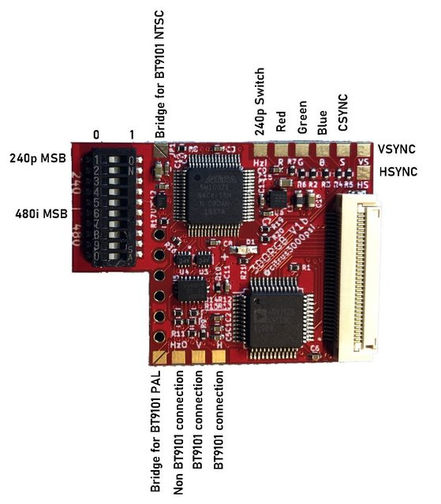
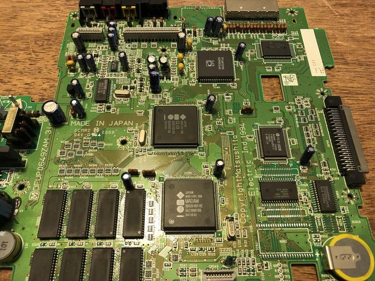
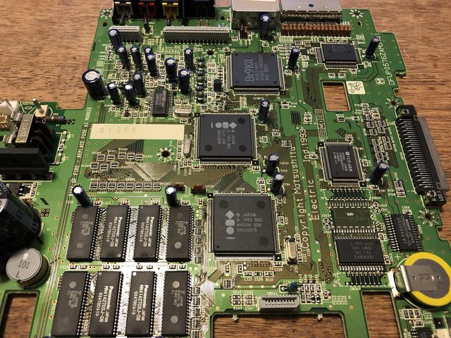
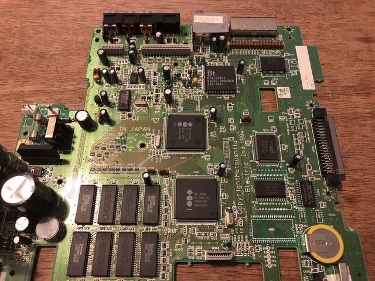
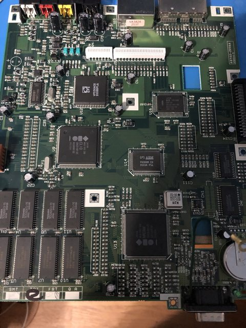
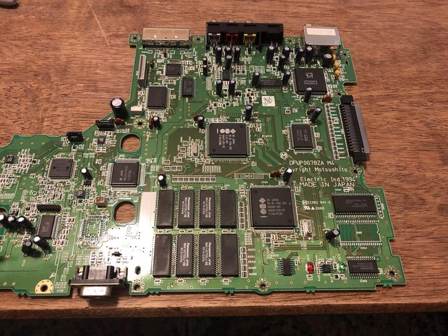

# 3DO Internal RGB Installation for all models except ANVIL (Late FZ-10 and Goldstar GDO-202)
**Disclaimer:**

This is kit is for advanced installers only. I am not responsible for damages to your console or damage to the kit. Each kit is personally tested by me and confirmed working before being shipped. This document assumes you know how to take apart the 3DO as these instructions will not be included.
**There are many variants of the 3DO, I do my very best to cover all contingencies, but I only have so many resources. If your mainboard has something different or you are unsure please contact me. Make sure you read and understand Step 1 before any installation attempt.**

**Here are some install videos that should only be used as supplements. Always use follow these written instructions.**

* FZ-10 w/ VP536a encoder (Sorry my head is in the way on a lot of this video) [Link](https://www.youtube.com/watch?v=dU8e0kHD8uc)
* FZ-1 w/ BT9101 encoder [Link](https://www.youtube.com/watch?v=lCsfs_3ef5E)

**This Kit includes:**

* Main PCB
* Flex Cable
* 3 PCB RGB Mounting Boards (Optional)
* 8Pin or 9Pin Mini Din (Optional)
* Slide Switch (Optional)

**Items required:**

* Temperature Controlled Soldering Iron w/good tips
* Flux
* Solder Wick
* 99% Isopropyl Alcohol
* Hookup wire
* Metal Cutting Tool, ie dremal (Optional)
* Drill & Drill Bits (Optional)

## Step 1.
Please do not skip this summary step. Read and understand the modification you are about perform.

**Board Prep:**

* Remove resistor to disconnect 240p signal connection from GPU (PIN 197) to Encoder (240p capable encoders only)
* Trace cut H/V signal connection from GPU (PIN 154 & 155) to Encoder (non 240p capable encoders only)
* Remove RF box if using optional Mini Din kit
* Some consoles do not have RF boxes. Plastic will need to be drilled/cut to mount a mini din & switch in this location.

**Installation:**
* Solder custom flex to GPU
* Mount RGB board
* Connect 240p signal from DAC to RGB board (240p capable encoders only)
* Connect H/V signals from GPU to RGB board (non 240p capable encoders only)
* Bridge JP1 on RGB board (non 240p capable encoders only)

**Mini Din Installation: (Optional)**
* Remove RF box.
* Mount Switch on Top PCB
* Install Custom PCB stack.
* Mount Mini Din
* Wire Mini Din to RGB Board

**RGB Board Summary HW1:**

* JP1 - Short for non 240p encoder only
* HzI - 240p/480i switch input (floating=240p / low=480i)
* R/G/B - Video data output (75 Ohm terminated)
* S - attenuated csync output (400mv)
* GND - Video data ground output
* HzO - 240p/480i signal to DAC (240p encoders only)
* V & H - Horizontal & Vertical Sync input from DAC (non 240p encoders only)

**RGB Board Summary HW2:**

This board revision has some new features that are not included in V1. Installation is almost identical to the V1, however you must now set the shift using jumpers.

* VGA output using VSYNC & HSYNC. 3.3V TTL
* PAL Supported added for BT9101 encoders
* Specific shift per resolution can be programmed to each console.
* LED Status to confirm mod is working (slow blink)
* No Jumper needs to be set for BT9103

[Click here for how to set jumpers for shift alignment.](shift_alignment.md)

## Step 2.
Please choose your motherboard type for specific installation instructions. (ANVIL mainboards are not supported)

[FZ-1 w/VP536a Encoder](fz1vp536a.md)

[FZ-1 w/BT9101 Encoder](fz1bt9101.md)

[FZ-1 w/BT9103 Encoder](fz1bt9103.md)

[Goldstar w/VP536a Encoder](goldvp536a.md)

[FZ-10 w/VP536a](fz10vp536a.md)

Help, my motherboard isn't listed. Send me a message with your console type ie, sanyo and the encoder use. I can likely tell you what to do based on pictures you send me.