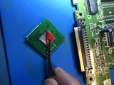

# FZ-10 w/VP536a Encoder Install Specific Instructions

**Disclaimer:**
 This is kit is for advanced installers only. I am not responsible for damages to your console or damage to the kit.  Each kit is personally tested by me and confirmed working before being shipped.  This document assumes you know how to take apart the 3DO as these instructions will not be included. 

**Verify your motherboard matches the picture below before continuing with the mod.**

## Step 3
 We need to prep the board that has a 240p capable encoder. Remove R166 if it exists. If the resistor is missing you will need to do a trace cut between the pads like in the image below.
*If trace cutting is required verify with a meter the trace is actually cut*

## Step 4
 Install the custom flex cable to the GPU.  Make sure the alignment is correct before soldering. The smallest amount of solder is needed when installing the flat flex.
*This flex is harder to install than other variants due to components being the way. Insert the flex at a slight angle and tack into the place.  Use tweezers to hold the flex flat in the area you are soldering.*
*Tack a few pins in the big center area first then align the leg into place and solder the 3 pins. After that finish the big section of the flex*

## Step 5
 Check adjacent pins for bridges that are not the same.
*If you skip this step and do not confirm you could damage the RGB mod board or the 3DO itself.*

## Step 6
 Remove the protective tape on the bottom side of the RGB board, insert the flex and then mount the board on top of the GPU.
*It is recommended to insert the flex before mounting so the RGB board aligns properly with the flex.*

## Step 7
 Run a small piece of wire from HzO to the pad of R166 as show in the images below
*I use small 30AWG solid core wire for this*

## Step 8
 At this point the mod is installed.  All that is left is to hookup some type of RGB connection and switch.  If a switch is not connected to HzI the console will always run in 240p\*. Pulling HzI low will make the console run in 480i. 
*\*Some games run too fast in 240p mode.  Its recommended to have a switch installed. This is a limitation of the console, not the mod.*

If using Hardware version V1b, please set the shift alignment dips [Click here for how to set jumpers for shift alignment.](3do_shift.md)
[If you purchased the optional RGB Mini Din kit click here for installation instructions.](3do_minidin.md)