
# 3DO Mini Din Addon Installation Instructions for all models

**Disclaimer:**

 This is kit is for advanced installers only. I am not responsible for damages to your console or damage to the kit.  Each kit is personally tested by me and confirmed working before being shipped.  This document assumes you know how to take apart the 3DO as these instructions will not be included.
 
\*\*There is a few models that do no have RF boxes (I think only JP units?). The RGB mount should work but the plastic will need to be cut.

\*\*Early JP models have a mode switch. This switch needs to be removed. A Mini Din install + switch can be installed in its location.

**The following instructions are for console with existing RF boxes only**

## Step 9
 Remove the RF box, be careful not to the rip the ground pads as these are used for the mini din mount. 
 If you have a desoldering gun that is recommended however desoldering braid works too. Here is a video of RF removal procedure with braid: https://youtu.be/PGArDUz8I9E

## Step 10
 Solder the switch to the TOP PCB

[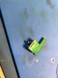](./images/minidin/step10a.jpg)

[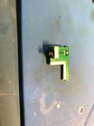](./images/minidin/step10b.jpg)

## Step 11
 Solder the middle PCB to the top PCB, align the half cut holes and and solder. (Don't go crazy with solder we are just tacking in to hold in place. These PCB's need to lay flat against each other)

[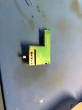](./images/minidin/step11a.jpg)

  Solder the bottom PCB next

[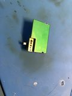](./images/minidin/step11b.jpg)

## Step 12
 Solder the two supplied pins to the 3DO motherboard.  Align them so they are closest to the edge
 
[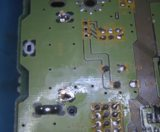](./images/minidin/step12a.png)

[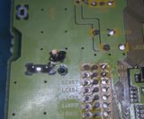](./images/minidin/step12b.png)

## Step 13
 Solder the PCB stackup to the pin and base of the 3DO motherboard. The stackup edge should be aligned perfectly with the edge of the 3DO motherboard.

[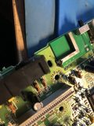](./images/minidin/step13.jpg)

## Step 14
 Reinsert the motherboard back into the 3DO case.  Place the Mini Dini connector in the pocket and make sure it is perfectly centered. Tack into place
*I find it easy to get the mini din aligned.  Then insert my finger into the hole to hold the mini din in place while soldering.*

[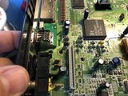](./images/minidin/step14.jpg)

## Step 15
 Verify you like the placement of the mini din, move if necessarily or fully solder into place.
 
[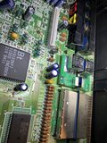](./images/minidin/step15.jpg)

## Step 16
 Solder the Mini Din PCB onto the Mini Din
 
[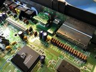](./images/minidin/step16.jpg)

## Step 17
 Connect the R/G/B/S pads to the corresponding points on the RGB mod board.  Also connect the 240 pad to the HzI on the RGB board 
*28 AW stranded wire is recommended*
*It is not neccessary to hookup the GND pad, the PCB stackup supplies the ground.*

[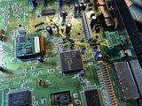](./images/minidin/step17.jpg)

## Step 18
 Connect the Left & Right audio channels to the mini din. Also connect a +5v source if you are using HD Retrovision cables or your scart setup requires it.

[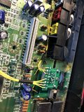](./images/minidin/step18.jpg)

## Step 19
 The mini din might make contact with the metal shield(s).  You have two options, don't install the metal shield or cut them.  Choice is up to you.
*Here are pictures of an FZ-1 with cut shields*

[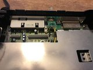](./images/minidin/step19a.jpg)

[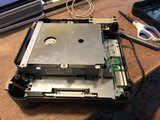](./images/minidin/step19b.jpg)

**You made it. If you did everything correct you will have crystal clear 240p RGB!  When testing the FZ-1, the CD-ROM must be connected to get video.**