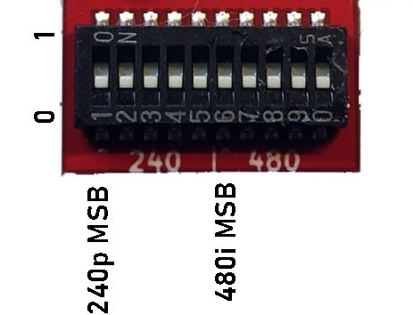
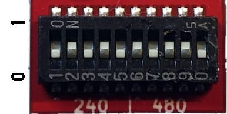
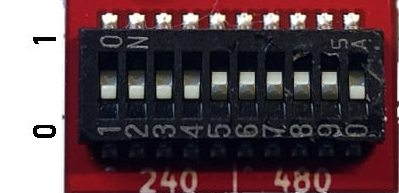

# V1b Shift Alignment instructions

\*\*\*9Pin HD retrovision cables will have trouble keeping sync if the image is to far to the left or to the right. You will need to "guess" a shift alignment before you will see an image or have stable sync.  Example 1 below is a good starting point.

Some consoles have a different propagation delay through the GPU.  Some are minor and some bigger.  To combat this problem the user now has to set the alignment per console.
 Two different alignments must be set, ie 240p and 480i.  The propagation delay is different when booting up in 240p vs 480i. So two alignments must be set.  The alignment can be set while the console is running.
 

In this default position, all dips are turned off and there is no shift applied.  The amount of shift is determined by binary. You can use a conversion program to convert decimal to binary here: https://www.rapidtables.com/convert/number/decimal-to-binary.md

Examples:

- 240p 10 pixel shift. (Binary Value 1010 or 01010)
- 480i 22 pixel shift. (Binary Value 10110)

- 240p 1 pixel shift. (Binary Value 1 or 00001)
- 480i 30 pixel shift. (Binary Value 11110)

